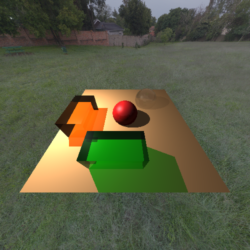
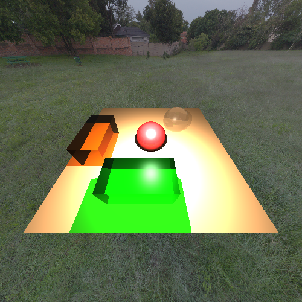
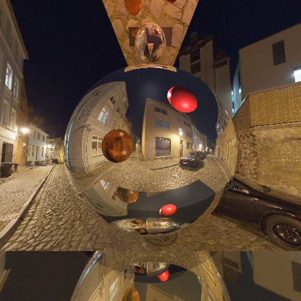
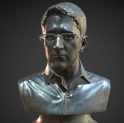
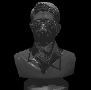

# Inverse Graphics

The goal of this project was to use this simple raytracer for some inverse graphics problems, where we try to infer 3d parameters given 2d images. 

## Methodology

First, we set the problem up as an optimization problem in the following manner:
1. **Loss Function**: The L2 Photometric loss is used as a measure of the 'distance' between two rendered images. It's implementation looks like:
```cpp
double photo_loss(const std::vector<Vec3> &im1, const std::vector<Vec3> &im2) {
    int n = im1.size();
    assert(n == im2.size());
    double diff = 0.0;
    for (int i = 0; i < n; i++) {
        diff += (im1.at(i) - im2.at(i)).length_sq();
    }
    return diff / n;
}
```

2. **Gradient Estimates**: While more advanced differentiable raytracing systems use a combination of auto-diff, analytical integration, and more advanced methods, for these examples I just used a simple finite difference method to estimate gradients. For more advanced problems, a stochastic-based approach to gradient estimates should be used instead. 

    For example, we may estimate the gradient of the x-coordinate of a single light in the scene (`sun`) as:


```cpp
sun.position.x += pertubation;
        high_loss = photo_loss(ground_truth, scene.render(WIDTH, HEIGHT));
        sun.position.x -= pertubation2;
        low_loss = photo_loss(ground_truth, scene.render(WIDTH, HEIGHT));
        grad.x = (high_loss - low_loss) / pertubation2;
```

3. **Algorithm**: I used the ADAM optimization algorithm for these examples, and it worked extremely quickly. 

## Examples 

I've set up some simple examples in the following folders to get a sense of what these problems look like and how difficult they are. To build these examples, run `make examples` from the root directory. Then navigate to an example's folder, and run the compiled `./example` binary.


### 1. Light Parameters with Simple Render - `Well_Posed_Example/`
This example is a proof-of-concept problem the uses a simple render as ground truth:



Then, we perturb the parameters of the light in the scene, and set these new parameters as the 'initial conditions': 



Finally, we apply ADAM:

https://github.com/user-attachments/assets/af463a68-80ee-48ed-9838-66c4e520447d

### 1. Material Parameters with Simple Render - `Ill_Posed_Example/`
This example is another proof-of-concept problem, where we construct a scene and set some initial parameters as our 'ground truth.'



In this case, the problem is to recover the material properties of the reflective sphere in the center of the image (specifically, the ambient, diffuse, and specular coefficients). I've labeled this problem as 'Ill-posed' for a couple reasons:

- For one, the loss function takes into account the entire image, while the subset of the image actually affected by changes in the material parameters is just a relatively small fraction. 
- Secondly, since the L2 loss is not very sensitive to outliers, we're likely to lose the specular highlights and instead just see the ambient coefficent increase (which causes the entire sphere to get brighter). 

Let's see what happens. First we set some initial conditions by pertubing the parameters (look carefully at the reflective sphere):


Finally, we apply ADAM. As expected, the final result has an ambient coefficient that is a bit higher than the ground truth material, but it actually recovered the specular highlight pretty well and overall performs better than expected with very little hyperparameter tuning.

https://github.com/user-attachments/assets/bd31dcca-154a-4ca5-81ff-12d296ef44f5

### 3. Inverse Problem With Triangulzarized Mesh - `Inverse_Problem_Example`
This example is an attempt at a much more complex problem, where we've moved on from rendered 'ground truth' images and instead attempt to recover some parameters from an image I screen grabbed off the web:



In this problem, we try to recover material and lighting parameters of the scene in which the screenshot was rendered. We start by loading the mesh into a scene:


