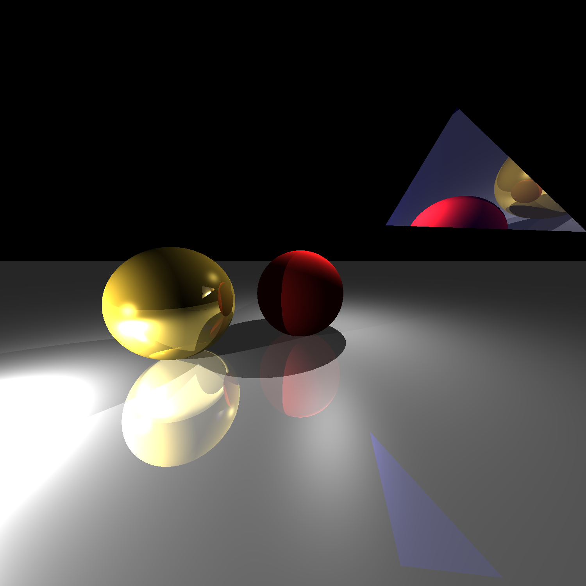

# Spritz

Spritz is a simple raytracer implemented in Python, using Numba's JIT compiler for performance.[^1]

## Examples - Renders

<div style="display: flex; gap: 10px; flex-wrap: wrap; justify-content: center;">


</div>


## How's it work? 

The rendering logic is simple, and looks something like:

```python
pixels = [] #array of RGB values to display

for each pixel on screen: #Trace a ray for each pixel in the image to be rendered

    #Generate a beam from the camera
    ray = camera.generate_ray(pixel.x, pixel.y)

    #Trace that ray until it hits a surface in the scene
    closest_hit = None
    for each surface in scene:
        surface_hit = surface.hit(ray)
        closest_hit = min(closest_hit, surface_hit)

    #Calculate the color of the surface hit by the ray
    pixel_color = (0.0, 0.0, 0.0) #RGB
    for each light in scene:
        light_contribution = light.illuminate(closest_hit)
        pixel_color += light_contribution

        #further logic for shadows and reflections
        ...

    pixels.append(pixel_color)
```

---

### 1. Cameras
Every scene starts with a `Camera` object, that is used to calculate the angle of the ray through each pixel. This ray is calculated using only the coordinates of the pixel on the virtual screen, the **aspect ratio** and **fov** of the screen, and the orientation of the camera, characterized by its three basis vectors **u** (up), **v** (right), and **w** (backwards, i.e. towards the viewer). The calculation of the rays allows for perspective viewing. If all the rays were parallel to the viewing screen, the resulting image would be in *orthographic* perspective.

<div style="display:flex;justify-content:center">
<pre><code class="language-python">
    <span style="color: darkorange">u -</span> <span style="color: gray">|</span>
        <span style="color: gray">|</span>                                             <span style="color: yellow;">  O</span>
     <span style="color: green">___<span style="color: gray">|</span>___             |\</span>
    <span style="color: green">|\______\_           | \</span>                                
<span style="color: gray">____</span><span style="color: green">||<span style="color: gray">_</span>     |_|</span>----------<span style="color: green">|  |</span>----------------------------------------<span style="color: violet">X</span>|
 <span style="color: darkorange">\</span>  <span style="color: green">\|___<span style="color: gray">\</span>__|            \  |</span>                                       / |
  <span style="color: darkorange">w</span>       <span style="color: gray">\</span>               <span style="color: green">\ |</span>                          _           /  |
       <span style="color: darkorange">v - </span><span style="color: gray">\</span>               <span style="color: green">\|</span>                         / \         /   |
<span style="color: red">______________________________________________________</span>\_/<span style="color: red">________</span>/<span style="color: red">____</span>|<span style="color: red">___________</span>
</code></pre>
</div>

> Here is a simple scene:
> - On the left in <span style="color: green">green</span> is a `Camera` object, with its <span style="color: darkorange">**u**</span>, <span style="color: darkorange">**v**</span>, and <span style="color: darkorange">**w**</span> basis vectors highlighted. 
> - In <span style="color: yellow">yellow</span> is a `PointLight` beaming down on the scene. Any time a ray hits a surface, this light will calculate its effect on the <span style="color: violet">point of intersection</span>.
> - At the bottom is a <span style="color: red">red</span> `Plane`, as well as a `Sphere` and a `Triangle`. 

---

### 2. Surfaces
Next, the scene must calculate the color of the ray that is sent out. It loops through every `Surface` in the scene to find the first object hit. Every `Surface` object (e.g, `Sphere`, `Triangle`, `Plane`) must come equipped with a method to calculate whether a given ray intersects with itself. If an intersection is found, it returns **t**, the time that the ray hit it, **n**, the normal vector to the surface at the point of intersection, and a reference to itself.

<div style="display:flex;justify-content:center">
<pre><code class="language-python">
<span style="color: green">            **     <span style="color: darkorange">Point of intersection</span>
          *    *  <span style="color: darkorange">/</span>
        *        </span><span style="color: violet">X</span><span style="color: gray">---------></span><span style="color: green">
        *        *</span>\   <span style="color: darkorange">\</span>
        <span style="color: green">  *    *</span>   \   <span style="color: darkorange">Surface normal (n)</span>
        <span style="color: green">    **</span>      \
        <span style="color: darkorange">/</span>            \  <span style="color: darkorange">- Ray from the camera</span>
<span style="color: darkorange">Sphere surface</span>        \
                       \
</code></pre>
</div>

> Here's a visualization showing what happens when a ray (coming from offscreen) hits a `Sphere` object. Some simple math tells us that the ray has intersected with the `Sphere` at point <span style="color: violet">X</span>, and so the `Sphere` will pass back to the render routine the following:
> - The point of intersection <span style="color: violet">X</span>
> - The surface normal <span style="color: darkorange">n</span> at the point of intersection
> - A reference back to the `Sphere` object that was hit.

---

### 3. Lights
Now that we know what object the ray hit, the color at the point of intersection is computed. For each light in the scene, a ray is beamed towards the point of intersection. If another object is in the way of a given light, then the point is in shadow, and that light makes no contribution. Otherwise, the illumination is computed based on the `Material` of the surface and the type of `Light`. Reflections are computed simply as a recursive call to the shade routine, with the reflected ray as the new beam. 

<div style="display:flex;justify-content:center">
<pre><code class="language-python">
                                      <span style="color: green;">X</span> <span style="color: darkorange;">- camera eye</span>
                                     / 
                <span style="color: yellow;">  O</span>          <span style="color: green;">_______</span>/<span style="color: green;">_</span>
                   \         <span style="color: green;">|</span>       <span style="color: green;">|</span>   <span style="color: darkorange;">- view screen</span>
                    \        <span style="color: green;">|____</span>/<span style="color: green;">__|</span>
    <span style="color: darkorange;">reflected ray - </span> \           /
                      \         /
                       \       /  <span style="color: darkorange;">- original ray</span>
                        \     /
                         \   /
                          \ /           
<span style="color: red">___________________________<span style="color: violet">X</span>___________________________</span>
    <span style="color: darkorange;">point of intersection /</span>
</code></pre>
</div>

> Here, the pixel would be shaded the color of the ray shot out from the eye. This ray struck a `Plane` at point <span style="color: violet">X</span>, and which is illuminated by `PointLight` <span style="color: yellow">O</span>, and so it's color would be calculated by passing the `Material` of the `Plane`, along with the ray and the surface normal at <span style="color: violet">X</span> to the illumination routine of `PointLight`.

---

[^1]: Reference: Fundamentals of Computer Graphics; 5th Edition